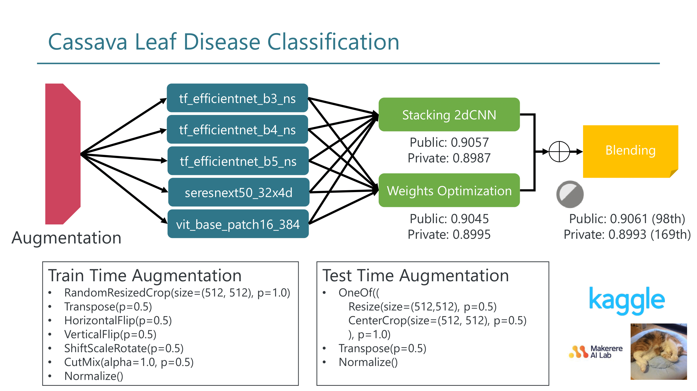

# Abstract
This repository is my solution for [Cassava Leaf Disease Classification][0]. 
Public: 98th, private: 169th
# Solution

# Link
## Stage1
- tf_efficientnet_b3_ns ([training][1])([inference][6])([dataset][11])
- tf_efficientnet_b4_ns ([training][2])([inference][7])([dataset][12])
- tf_efficientnet_b5_ns ([training][3])([inference][8])([dataset][13])
- seresnext50_32x4d ([training][4])([inference][9])([dataset][14])
- tf_efficientnet_b3_ns ([training][5])([inference][10])([dataset][15])
## Stage2
- stacking 2dCNN ([training][16])([inference][18])
- Weights Optimization ([training][17])([inference][19])
## Final Submission
- Blending ([inference][20])

[0]:https://www.kaggle.com/c/cassava-leaf-disease-classification
[1]:notebook/20t-efficientnet_b3-cutmix-tta.ipynb.ipynb
[2]:notebook/22t-efficientnet_b4-cutmix-tta.ipynb.ipynb
[3]:notebook/34t-efficientnet_b5.ipynb
[4]:notebook/33t_seresnext50.ipynb
[5]:notebook/35t-vit16.ipynb
[6]:https://www.kaggle.com/raipachi0704/20i-efficientnet-b3-later-cutmix-tta
[7]:https://www.kaggle.com/raipachi0704/22i-efficientnet-b4-cutmix-tta
[8]:https://www.kaggle.com/raipachi0704/34i-efficientnet-b5
[9]:https://www.kaggle.com/raipachi0704/33i-seresnext50
[10]:https://www.kaggle.com/raipachi0704/35i-vit16
[11]:https://www.kaggle.com/raipachi0704/20t-efficientnet-b3-cutmix-tta
[12]:https://www.kaggle.com/raipachi0704/22t-efficientnet-b4-cutmix-tta
[13]:https://www.kaggle.com/raipachi0704/33t-seresnext50
[14]:https://www.kaggle.com/raipachi0704/34t-efficientnet-b5
[15]:https://www.kaggle.com/raipachi0704/35t-vit16/settings
[16]:https://www.kaggle.com/raipachi0704/train-stacking-2dcnn-ver3
[17]:https://www.kaggle.com/raipachi0704/train-weights-optimization
[18]:https://www.kaggle.com/raipachi0704/inference-stacking-2dcnn-ver3
[19]:https://www.kaggle.com/raipachi0704/inference-weights-optimization
[20]:https://www.kaggle.com/raipachi0704/inference-blending-2dcnn-ver3-weights